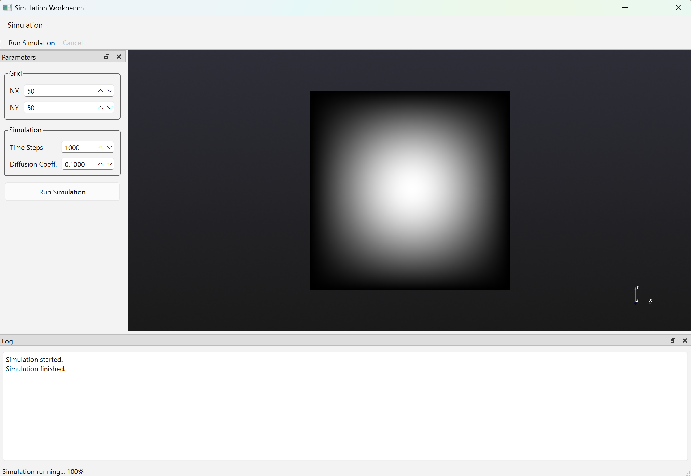

# SimulationWorkBench
A modular C++17 desktop application using Qt and VTK for numerical simulation and scientific visualization of a 2D diffusion model.
## Overview

Simulation Workbench is a modular **desktop scientific application** built with  
**Qt 6, VTK 9.5.2, and modern C++ (C++17)**.

The project demonstrates the core architecture and workflows commonly used in
**engineering and geoscience simulation software**, including numerical
computation, asynchronous execution, and scientific visualization.

A simple **2D diffusion equation** is implemented using a finite-difference
scheme, and the final simulation result is visualized through a VTK rendering
pipeline embedded in a Qt-based UI.

---

## Demo Screenshot

> 📸 *Final simulation result visualized with VTK (orthographic projection, orientation axes enabled)*




---

## Architecture Overview

```
app  -> Qt UI, controllers
core -> numerical simulation engine
viz  -> VTK scientific visualization
```

---

## Key Features

- Modular C++ architecture (core / viz / app)
- Asynchronous execution using QtConcurrent
- Cooperative cancellation support
- VTK-based scientific visualization
- Embedded QVTKOpenGLNativeWidget
- Orthographic camera and orientation axes
- Parameter-driven Qt UI with logging

---

## Project Structure

```
SimulationWorkBench/
├── app/
├── core/
├── viz/
├── docs/
└── CMakeLists.txt
```

---

## Build Environment

- Operating System: Windows 11 (64-bit)
- Compiler: MSVC 2022 (x64)
- Qt: 6.10.1 (shared libraries)
- VTK: 9.5.2 (shared libraries)
  - VTK_GUISupportQt
  - VTK_RenderingOpenGL2
- CMake: 4.2.0
- C++ Standard: C++17

---

## Build Instructions (Windows)

```bash
git clone https://github.com/hugohu789-droid/SimulationWorkBench.git
cd simulation-workbench

mkdir build
cd build

cmake -S .. -B . ^
  -DCMAKE_BUILD_TYPE=Release ^
  -DCMAKE_PREFIX_PATH="Qt_install_dir/6.10.1/msvc2022_64"

cmake --build . --config Release
```

---

## Usage

1. Launch SimulationWorkBench.exe
2. Adjust simulation parameters
3. Click Run Simulation
4. View results in the central visualization window

---

## License
This project is licensed under the Apache License 2.0.
