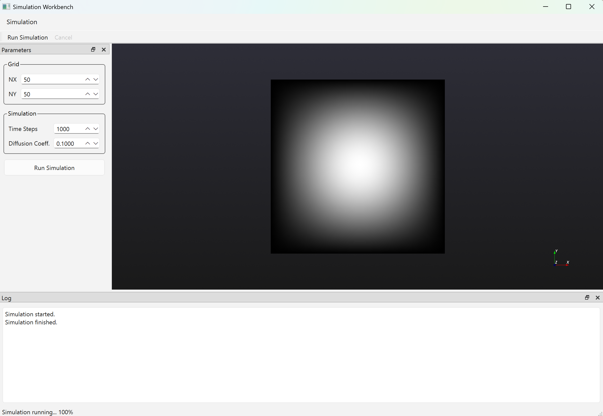

# SimulationWorkBench

A modular C++17 desktop application using Qt and VTK for numerical simulation and scientific visualization of a 2D diffusion model.

---

## Overview

SimulationWorkBench is a modular **desktop scientific application** built with **Qt 6, VTK 9.5.2, and modern C++ (C++17)**.

The project demonstrates the core architecture and workflows commonly used in **engineering and geoscience simulation software**, including numerical computation, asynchronous execution, and scientific visualization.

A simple **2D diffusion equation** is implemented using a finite-difference scheme, and the final simulation result is visualized through a VTK rendering pipeline embedded in a Qt-based UI.

---

## Demo Screenshot

> 📸 *Final simulation result visualized with VTK (orthographic projection, orientation axes enabled)*



---

## Architecture Overview

```
app  →  Qt UI, controllers
core →  numerical simulation engine
viz  →  VTK scientific visualization
```

---

## Key Features

- Modular C++ architecture (core / viz / app)
- Asynchronous execution using QtConcurrent
- Cooperative cancellation support
- VTK-based scientific visualization with QVTKOpenGLNativeWidget
- Orthographic camera and orientation axes widget
- Parameter-driven Qt UI with logging panel
- Cross-platform: tested on Windows 11 and macOS

---

## Project Structure

```
SimulationWorkBench/
├── app/           # Qt UI, MainWindow, controllers
├── core/          # Simulation engine and config
├── viz/           # VTK rendering and adapter
├── docs/
└── CMakeLists.txt
```

---

## Build Requirements

| Dependency | Version  |
|------------|----------|
| CMake      | ≥ 3.16   |
| C++        | 17       |
| Qt         | 6.x      |
| VTK        | 9.5.2    |

Required VTK modules: `VTK_GUISupportQt`, `VTK_RenderingOpenGL2`

---

## Build Instructions

### Windows (MSVC 2022)

```bash
git clone https://github.com/hugohu789-droid/SimulationWorkBench.git
cd SimulationWorkBench

cmake -S . -B build ^
  -DCMAKE_BUILD_TYPE=Release ^
  -DCMAKE_PREFIX_PATH="<Qt_install_dir>/6.x.x/msvc2022_64;<VTK_install_dir>"

cmake --build build --config Release
```

### macOS (Clang)

```bash
git clone https://github.com/hugohu789-droid/SimulationWorkBench.git
cd SimulationWorkBench

cmake -S . -B build \
  -DCMAKE_BUILD_TYPE=Release \
  -DCMAKE_PREFIX_PATH="<Qt_install_dir>/6.x.x/macos;<VTK_install_dir>"

cmake --build build --config Release
```

> **macOS note:** The application requires an OpenGL Core Profile context. This is handled automatically via `QVTKOpenGLNativeWidget::defaultFormat()` set before `QApplication` is created.

---

## Usage

1. Launch `SimulationWorkBench` (`.exe` on Windows)
2. Adjust simulation parameters in the left panel
3. Click **Run Simulation** (or press `F5`)
4. View the result in the central visualization window
5. Press **Cancel** (or `Esc`) to abort a running simulation

---

## License

This project is licensed under the [Apache License 2.0](LICENSE).
